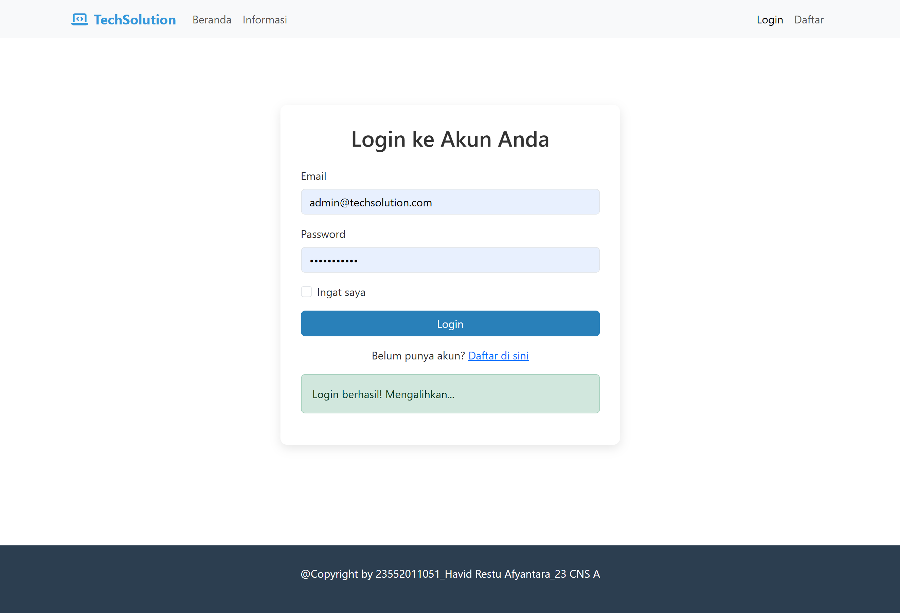
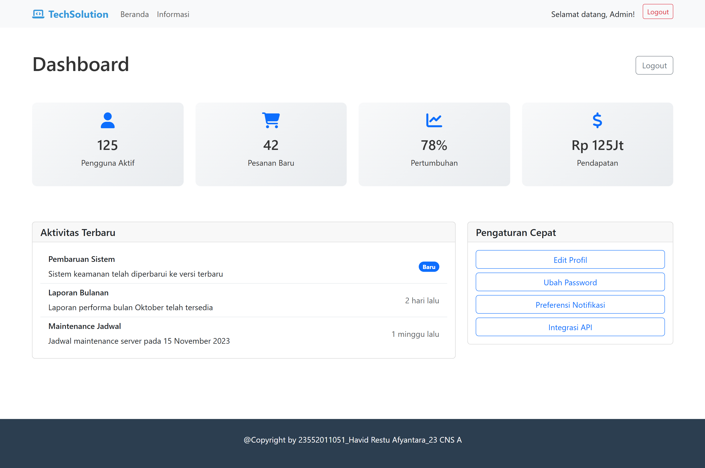
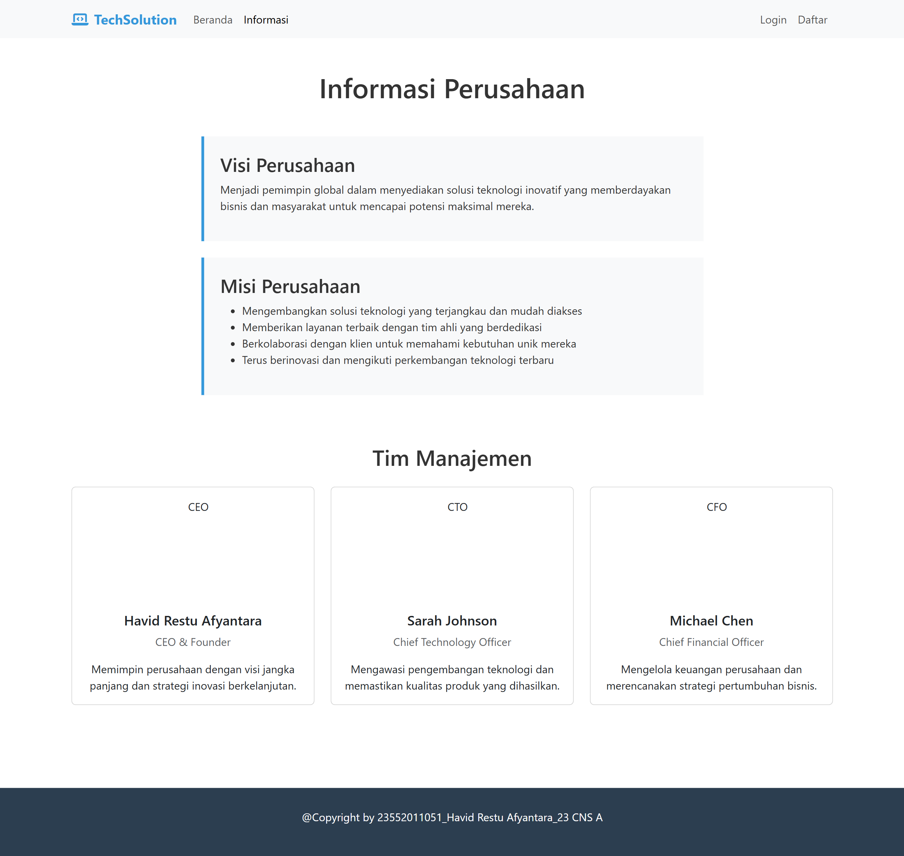
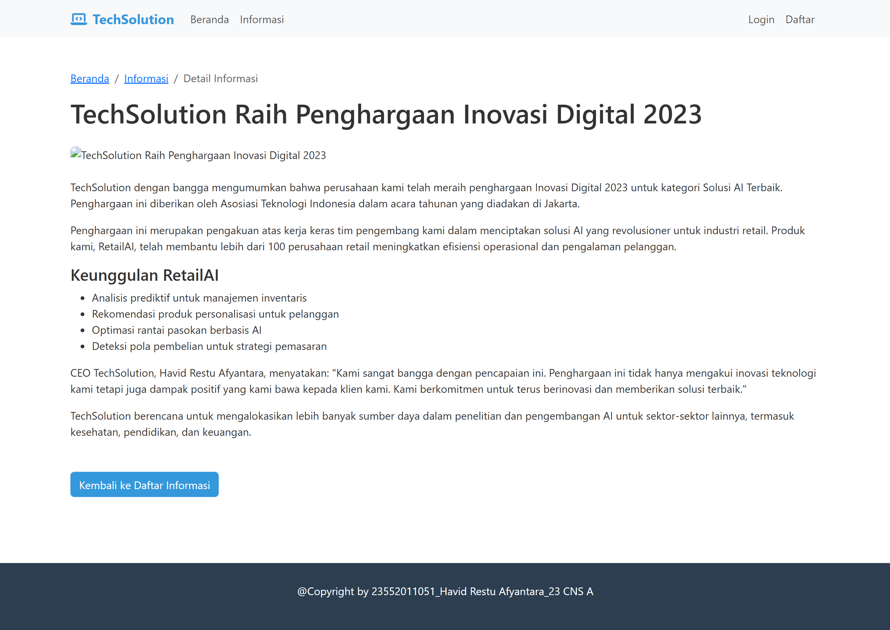
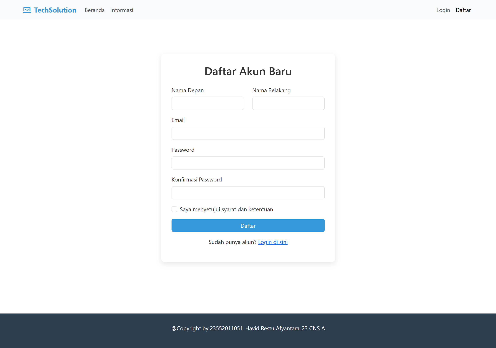
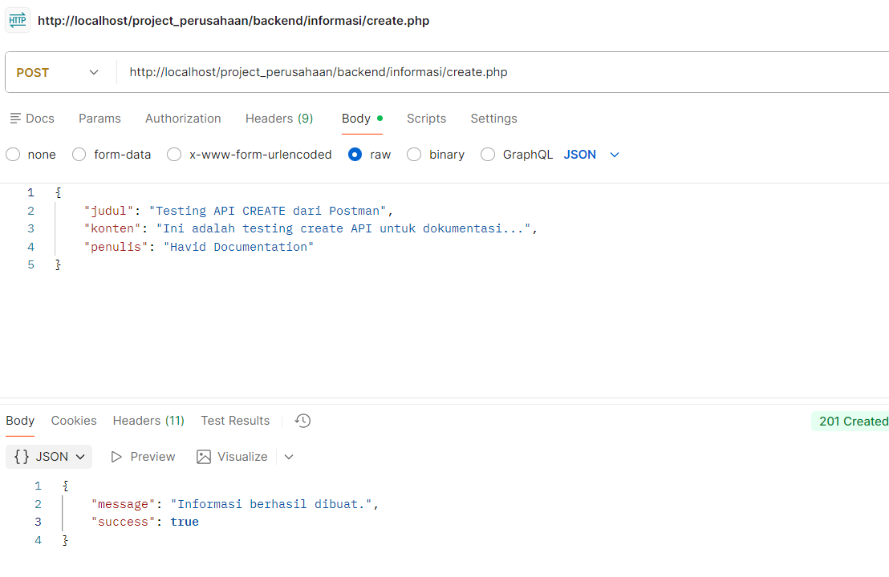
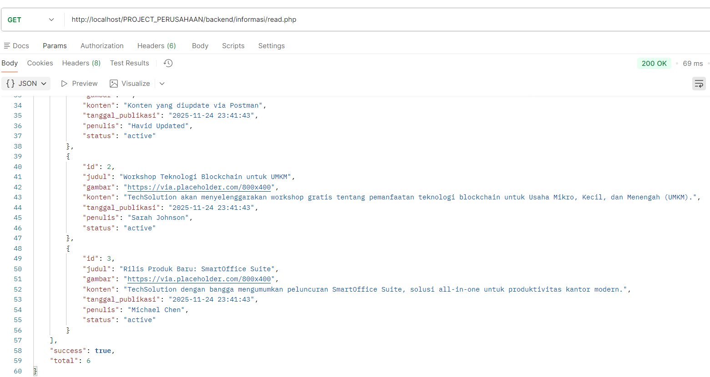
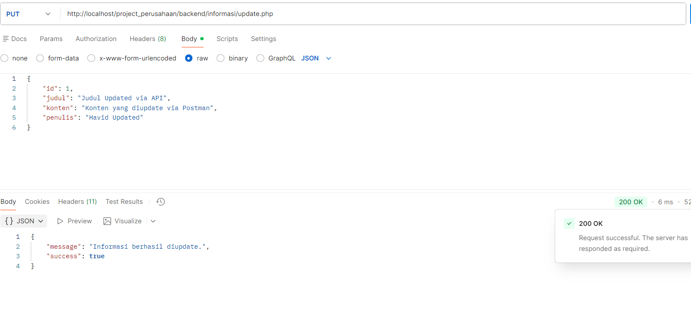
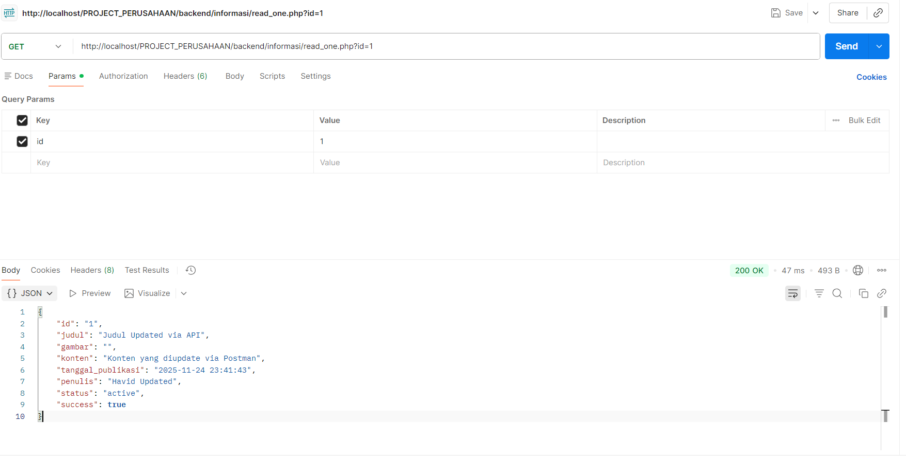
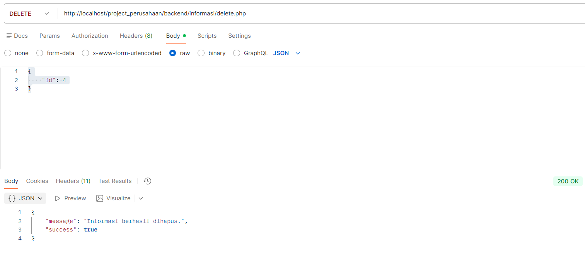

# 🏢 TechSolution - Project 1 & 2

## 📋 Daftar Isi
- [Project 1: Company Website](#project-1-company-website)
- [Project 2: CRUD API](#project-2-crud-api)
- [Struktur Project](#struktur-project)
- [Cara Menjalankan](#cara-menjalankan)
- [Testing](#testing)
- [Developer](#developer)

---

## 🎨 Project 1: Company Website

### Deskripsi
Website perusahaan TechSolution yang dibuat menggunakan HTML, CSS, JavaScript, dan Bootstrap Framework.

### Fitur
- ✅ Halaman Utama (Homepage)
- ✅ Halaman Informasi Perusahaan
- ✅ Halaman Detail Informasi
- ✅ Halaman Login dengan Validasi JavaScript
- ✅ Halaman Registrasi
- ✅ Halaman Dashboard (Setelah Login)
- ✅ Design Responsive dengan Bootstrap
- ✅ Footer dengan Copyright

### Screenshot Frontend

**Halaman Utama** | **Halaman Login** | **Dashboard**
-----------------|------------------|---------------
 |  | 

**Halaman Informasi** | **Detail Informasi** | **Registrasi**
---------------------|----------------------|---------------
 |  | 

---

## 🚀 Project 2: CRUD API

### Deskripsi
RESTful API untuk mengelola data informasi perusahaan dengan operasi CRUD lengkap.

### API Endpoints

| Method | Endpoint | Description | Status |
|--------|----------|-------------|--------|
| GET | `/backend/informasi/read.php` | Get all informasi | ✅ |
| GET | `/backend/informasi/read_one.php?id=1` | Get single informasi | ✅ |
| POST | `/backend/informasi/create.php` | Create new informasi | ✅ |
| PUT | `/backend/informasi/update.php` | Update informasi | ✅ |
| DELETE | `/backend/informasi/delete.php` | Delete informasi | ✅ |

### Screenshot API Testing

**CREATE** | **READ ALL** | **UPDATE**
-----------|-------------|-----------
 |  | 

**READ ONE** | **DELETE**
-------------|-----------
 | 

### Contoh Response API
```json
{
    "data": [
        {
            "id": 1,
            "judul": "TechSolution Raih Penghargaan Inovasi Digital 2023",
            "gambar": "https://via.placeholder.com/800x400",
            "konten": "TechSolution dengan bangga mengumumkan bahwa perusahaan kami telah meraih penghargaan...",
            "tanggal_publikasi": "2025-11-24 23:41:43",
            "penulis": "Havid Restu Afyantara",
            "status": "active"
        }
    ],
    "success": true,
    "total": 3
}
